# PyBer Ride-Sharing Analysis

## Overview of Ride-Sharing Analysis
In this module, we have been hired as a data analyst by PyBer, which is a fictional Python-based ride-sharing company. Earlier in the lesson, we were tasked with creating Python scripts using Pandas libraries along with Jupyter Notebook and Matplotlib to find correlations between the type of city (urban, suburban, or rural) and the number of drivers and riders, as well as the percentage of total fares, riders, and drivers. These correlations were to be presented to the implausibly-named V. Isualize, the PyBer CEO.

In this Challenge assignment, we have been given two new datasets and a new assignment from V. Isualize to create a DataFrame containing a summary of the ride-sharing data by city type, as well as a plot showing the total weekly fares by city type.

The first dataset ([city_data.csv](resources/city_data.csv)) has aggregate information about the cities in which rides occur, including the city name, the number of drivers in that city, and what type of city it is.

The second dataset ([ride_data.csv](resources/ride_data.csv)) has more granular information about individual rides, including the ride ID, the date on which the ride occurred, the fare for the ride, and the city in which the ride took place.

We have been given the three deliverables shown below, along with subtasks for each deliverable which we will walk through further down. The text for each deliverable is taken from [PyBer_Challenge.ipynb](PyBer_Challenge.ipynb). Below each subtask is an image of the code necessary to complete it. Output from running the code can be found in the submitted [PyBer_Challenge.ipynb](PyBer_Challenge.ipynb) file.

- Deliverable 1: Generate a ride-sharing summary DataFrame by city type.
- Deliverable 2: Create a multiple-line chart of total fares for each city type.
- Deliverable 3: Write a report on the PyBer analysis.

## resources
- Data Source: [city_data.csv](resources/city_data.csv) and [ride_data.csv](resources/ride_data.csv)
- Software: Python 3.7.7, Conda 22.11.0, Jupyter Notebook 5.7.10

## Data Preparation
Prior to completing the deliverables, code was written to read the two .csv datasets and then merge them such that the line containing data for each ride (from [ride_data.csv](resources/ride_data.csv)) also contained the data for the city in that line (from [city_data.csv](resources/city_data.csv)).

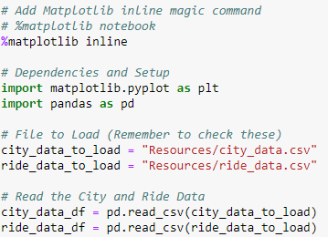

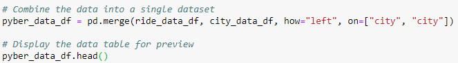

## Deliverable 1: Generate a ride-sharing summary DataFrame by city type

1. Get the total rides for each city type by using the `groupby` function to create a Series of data that has the type of city as the index, then apply the `count` method to the "ride_id" column.

    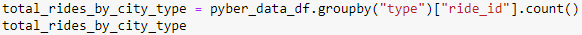

2. Get the total drivers for each city type by using the `groupby` function to create a Series of data that has the type of city as the index, then apply the `sum` method to the "driver_count" column.

    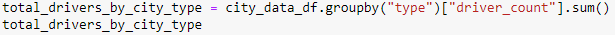

3. Get the total amount of fares for each city type by using the `groupby` function to create a Series of data that has the type of city as the index, then apply the `sum` method to the "fare" column.

    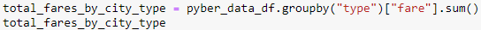

4. Get the average fare per ride for each city type by dividing the sum of all the fares by the total rides.

    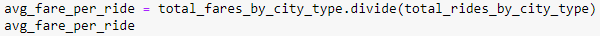

5. Get the average fare per driver for each city type by dividing the sum of all the fares by the total drivers.

    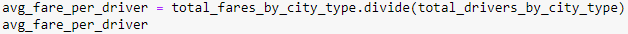

6. Create a PyBer summary DataFrame with all the data gathered from Steps 1-5, using the following column names: "Total Rides", "Total Drivers", "Total Fares", "Average Fare Per Ride", and "Average Fare Per Driver".

    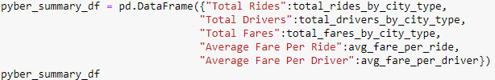

7. Clean up the DataFrame by using the provided code snippet to remove the index name ("type") from the PyBer summary DataFrame.

    

8. Format the columns with commas to separate the thousands and as currency where appropriate.

    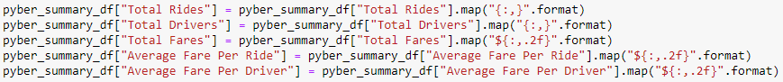

## Deliverable 2: Create a multiple-line chart of total fares for each city type

1. Create a new DataFrame with multiple indices using the `groupby` function on the "type" and "date" columns of the `pyber_data_df` DataFrame, then apply the `sum` method on the "fare" column to show the total fare amount for each date.

    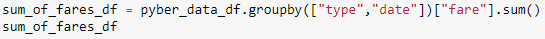

2. Reset the index on the DataFrame created in #1. This is needed to use the `pivot` function in the next step.

    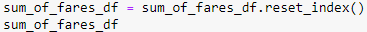

3. Create a pivot table using the `pivot` function with the 'date' as the index, the columns ='type', and values='fare' to get the total fares for each type of city by the date.

   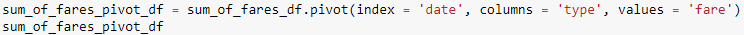

4. Create a new DataFrame from the pivot table DataFrame using `loc` on the given dates, '2019-01-01':'2019-04-28'.

    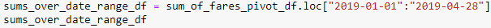

5. Set the "date" index to datetime datatype. This is necessary to use the `resample` method in Step 7.

    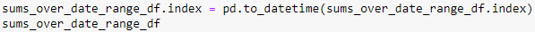

6. Check that the datatype for the index is datetime using `df.info`.

    

7. Create a new DataFrame using the `resample` function by week 'W', and then apply the `sum` method to get the total fares for each week.

    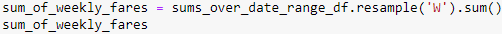

8. Graph the resampled DataFrame from Step 7 using the object-oriented interface method and the `df.plot` method, as well as the Matplotlib `"fivethirtyeight"` graph style code snippet provided in the starter code. Annotate the y-axis label and the title, then use the appropriate code to save the figure as `PyBer_fare_summary.png` in the "analysis" folder.

    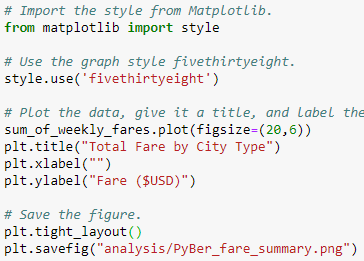

## Deliverable 3: A written analysis of the PyBer results

### Results
The final resulting Data Frame containing all of the summary data is shown here:

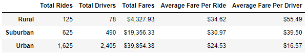

**The number of drivers and rides as well as the total fares increase going from rural to urban cities.** These numbers scale with city population as expected and thus are not very informative as a result. It would be more interesting to normalize the numbers of drivers and rides and total fares by city population (for instance, drivers or rides per 100,000 residents) and then see how these values compare. PyBer would want the normalized values to be roughly equal between the three city types to make sure there is an appropriate balance between the number of riders and drivers.

Speaking of the balance between riders and drivers, **the average fares per rider and per driver actually decrease as city size increases**. There are a couple reasons for this.
- First is simple economics: supply vs. demand. In rural towns, there are fewer drivers overall so they are able to charge more per ride. Increasing the number of drivers would cause the price per ride to come down. However in urban cities, there is actually an oversupply of drivers. Looking at the chart above, there are 2,405 drivers and only 1,625 rides meaning at least 780 drivers completed ZERO rides. These customer-less drivers bring the overall average fare per driver down by contributing to the driver count but not to higher total fares. Additionally, in urban environments there are often alternate modes of transportation such as trains, buses, or even walking, so people may opt for those instead of riding with PyBer.
- Second is the amount of sprawl or building/population density of each city type. In urban cities, people and places are more densely packed together. A customer may only have to travel a few blocks to their destination, so rides tend to be shorter and cheaper. In rural areas, sprawl is much greater; a PyBer customer may need to travel many miles to reach their destination. Longer rides mean higher fares.

The final line plot showing Total Fare By City Type over January through April of 2019 for all city types is shown here:

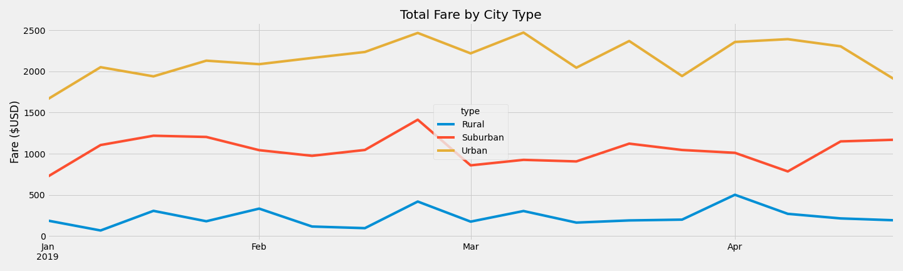

There are no concrete time-dependent trends correlating total fare to a given week. However despite the disadvantages mentioned above, **urban cities generate the highest total fares of the given city types**. Again, this plot might be more useful if normalized by population (per 100,000 residents).

### Summary
Below are my recommendations to CEO V. Isualize to improve overall profits for PyBer:

1. Institute a set of surveys in all city types focusing on questions such as: a) are PyBer drivers readily available when you need them or do you have a significant wait? or b) are PyBer ride prices low enough that you would consider them over alternatives such as the subway or bus?

2. Based on survey results, tweak the number of drivers and ride prices in each city. For instance, the number of drivers needs to be increased in rural cities to bring the price down to make PyBer more attractive. The lower profit margin will hopefully be made up for with ride volume. In urban cities, there are too many drivers. Re-allocate some of these resources by encouraging some of the urban city drivers to work in the suburbs or more rural areas to increase the number of drivers there. Additionally, the ride fare in urban cities can be adjusted to ensure that PyBer is competitive with other modes of transportation.

3. Institute a targeted advertising campaign geared toward each city type to increase ridership. Currently each driver only completes 1-2 rides. An ad campaign will hopefully bring in more riders who ride more frequently, driving up the ride volume and total ride fares. However, a balance must be struck such that there are not too many riders and too few drivers, resulting in increased wait times. Examples of potential ad campaigns include: a) for rural cities, a combined "don't drink and drive" and PyBer ad suggesting that "A PyBer is cheaper than a DUI!" or b) in urban cities an ad designed to compete directly with taxi cabs suggesting "A PyBer is cheaper than a cab!".